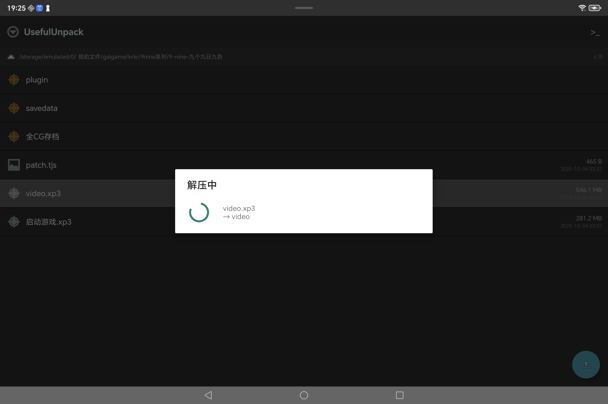
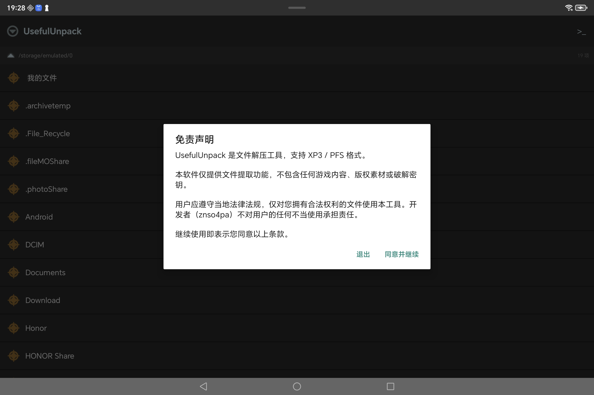
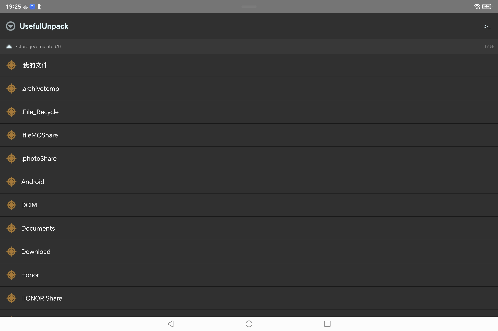
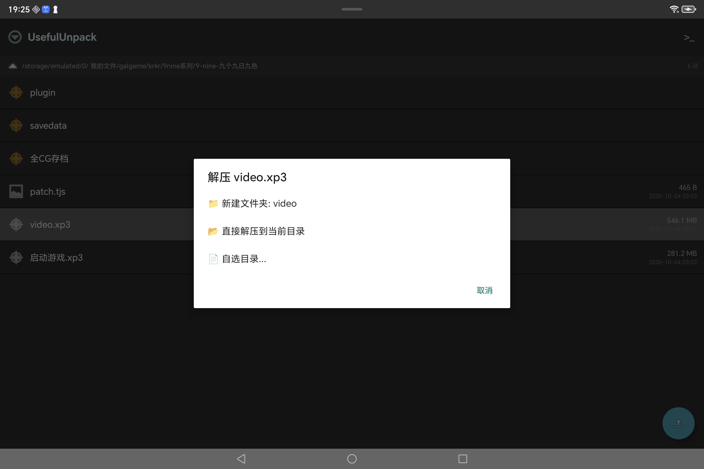

# UsefulUnpack

[**中文**](README-zh.md) | [**English**](README.md) | [**繁體中文**](README-zh-TW.md) | [**日本語**](README-ja.md)

輕量級 Android 檔案管理器 & 歸檔打包/解壓工具

支援 **XP3**（吉里吉里）、**PFS**（Artemis）、**NSA/SAR**（NScripter）、**YPF**（YU-RIS）、**RGSS**（RPG Maker XP/VX/VX Ace）、**KSD**（吉里吉里2）、**ISO 9660** 光碟映像，以及 **ZIP**、**7z**、**RAR**、**TAR**、**GZIP**、**BZIP2**、**XZ**、**ZSTD**、**LZMA**、**LZ4** 等通用格式（均支援打包與解壓），Rust 原生核心。

---

## 功能

| 功能 | 說明 |
|------|------|
| ✂️ **XP3** | 解壓 + 封包吉里吉里 `.xp3` |
| 📦 **PFS** | 解壓 + 封包 Artemis `.pfs` / `.pf6` / `.pf8` |
| 📜 **NSA/SAR** | 解壓 NScripter `.nsa` / `.sar` 封包（LZSS + SPB） |
| 📦 **YPF** | 解壓 YU-RIS `.ypf` 封包，三層自適應邊界檢測 |
| 🎮 **RPG Maker MV/MZ** | 解碼 + 回封逐檔混淆素材（回封需自填金鑰）：`.rpgmvp` 圖片、`.rpgmvo` 音訊、`.rpgmvm` 影片（以及 MZ 的 `.png_` / `.ogg_` / `.m4a_`）；16 位元組檔頭可從檔案自身還原，**不需金鑰**（檔案沒有副檔名時也認得出，靠內容判斷型別）；回封金鑰接受 32 位十六進位（原樣使用）或任意文字（依 RPG Maker 的規則做 MD5）；**每個格式只收自己的類型：`.rpgmvp` 收 `.png`、`.rpgmvo` 收 `.ogg`、`.rpgmvm` 收 `.m4a`**，其餘一律擋下，因為引擎是依副檔名選解碼器的；產物依真實副檔名命名，可直接進圖片 / 音訊預覽；批次模式一次解碼整個資料夾 |
| 🎮 **RGSS** | 解壓 + 封包 RPG Maker 加密封包：`.rgssad`（XP）、`.rgss2a`（VX）、`.rgss3a`（VX Ace）；版面依封包標頭自動辨識，三種副檔名互相都能開啟；檔名 UTF-8 / Shift-JIS；可編輯腳本；**封包產物預設命名為 `Game.<ext>`**（RPG Maker 只認這個名字），封包選項裡可關 |
| 💾 **KSD** | 解壓/打包 `.ksd`（mode 0/1/2 解擾 + UTF-16→UTF-8） |
| 🗜️ **通用壓縮** | ZIP/7z + gzip/bzip2/xz/zstd/lzma/lz4（單檔）+ tar（資料夾 5 變體）+ xp3/pfs/ksd，5 級壓縮程度，AES-256（ZIP） |
| 📚 **分卷支援** | 解壓 `.7z.001` / `.zip.001` / `.rar` 分卷；zip/7z 壓縮支援依大小切分卷（相容 7-Zip） |
| 🎚️ **自訂分卷大小** | 分卷大小自訂（MB/GB，1MB~2GB） |
| 🔐 **解壓密碼** | 加密的 ZIP/7z/RAR 先彈密碼框再解壓；批次解壓只需輸入一次密碼，全部歸檔重用 |
| 🔒 **密碼標記** | 檔案瀏覽器與預覽清單中，需要密碼的歸檔顯示鎖圖示 |
| 📊 **雙層進度條** | 頂部=全量進度，底部=目前檔案進度（解壓+壓縮）；大（>64MB）RAR 成員串流解碼，頂條位元組級平滑推進而非每檔案跳段 |
| 📋 **分組格式選擇器** | 可捲動分組格式選擇（通用壓縮 / 單檔 / 其他），解壓/批次/壓縮共用 |
| 📄 **單檔壓縮按鈕** | 壓縮模式下點擊任意檔案，右下角彈出壓縮按鈕 |
| 📦 **批次壓縮選擇器** | 批次合併/分別壓縮都彈格式選擇器，合併排除單檔格式 |
| 🗜️ **RAR** | 解壓 RAR 封包（RAR4/5），支援密碼；**頭加密（-hp）歸檔**彈密碼框後可用密碼預覽/解壓；**>64MB 成員串流解碼**（位元組級進度、記憶體有界，100~500MB 成員不再整塊緩衝）；**非 solid 歸檔選中解壓/預覽隨機存取**（末尾 txt 秒開，跳過前面所有成員）；**Huffman 查表解碼加速**（~30%） |
| ⚡ **LZ4** | 打包/解包 LZ4 幀壓縮檔案 |
| 🗜️ **TAR** | 打包/解包 `.tar`、`.tar.gz`、`.tgz`、`.tar.bz2`、`.tbz2`、`.tar.xz`、`.txz`、`.tar.zst` |
| 🗜️ **GZIP** | 打包/解包 `.gz` |
| 🗜️ **BZIP2** | 打包/解包 `.bz2` |
| 🗜️ **XZ** | 打包/解包 `.xz` |
| 🗜️ **ZSTD** | 打包/解包 `.zst` |
| 🗜️ **LZMA** | 打包/解包 `.lzma` |
| 💿 **ISO 9660** | 瀏覽和提取 ISO 光碟映像 |
| 🔍 **歸檔預覽** | 樹形預覽歸檔內容，可折疊/展開，複選框選擇性解壓 |
| 📊 **預覽統計** | 即時檔案總數/總大小 + 已選統計 |
| 🔎 **全域搜尋** | 檔名搜尋 + 內容搜尋（支援 30+ 文字格式），高亮導航，繼續掃描 |
| 📦 **歸檔內搜尋** | 預覽歸檔時一鍵解包並搜尋內部檔案 |
| 🖼️ **檔案預覽** | 圖片、音訊、影片、文字/程式碼直接預覽；**Markdown/RTF 富文字渲染**（渲染/純文字切換） |
| 📂 **本機預覽** | 瀏覽器中直接點擊可預覽檔案 |
| 🗂 **檔案瀏覽器** | 類 ZArchiver 介面，路徑麵包屑，資料夾 ⭐ 星標 |
| 🪟 **多視窗 Tab** | 最多 3 個獨立視窗（ViewPager2 滑動切換，可新增/關閉），每視窗各自記住路徑、選中檔案、多選狀態、批次列與貼上/移動狀態，互不干擾；**長按標籤可重新命名視窗**；Chrome 式頂置 Tab 欄（活動標籤圓角高亮） |
| 📦 **內嵌歸檔預覽** | FAB 預覽歸檔直接渲染進目前視窗（非彈窗），**預覽時可滑動切換視窗**；底部一鍵解壓全部/提取選中/合併到（無可合併目標時按鈕置灰，不會點出死路），頂欄搜尋 + **⋮ 溢出選單**（編輯/ZIP 管理/ISO 轉換，依格式顯隱，不支援時 toast 提示）；預覽中進入全域搜尋後關閉搜尋回到預覽 |
| 🔀 **跨歸檔合併提取** | 預覽勾選項目 → 「合併到…」→ 目標可選**本資料夾，或其他視窗正開啟的歸檔**（分組清單，標註所屬視窗）→ 把來源勾選項目與目標解包到同一個暫存目錄（同名路徑由來源覆蓋），再封包成 `目標-cn.ext` 副本放在目標旁邊。**目標全程唯讀、原歸檔一個位元組不動**，所以合併進別人正預覽著的歸檔也是安全的；沒有可合併目標時按鈕置灰 |
| 📍 **選擇路徑/檔案方式** | 一般設定可選「直接開啟路徑介面」或「在新視窗中開啟選擇」——後者開新視窗瀏覽選擇，選中後關閉該視窗返回原視窗（適用於搜尋範圍/提取目標/ZIP 新增/壓縮目標） |
| 📌 **書籤** | 資料夾星標 + 側滑抽屜 |
| ✂️ **檔案操作** | 長按重新命名、移動、刪除（不可復原）、新增資料夾 |
| ☑️ **多選批次** | 進入多選模式後批次解壓/壓縮/刪除/移動 |
| 📂 **批次預覽** | 多選歸檔統一檢視內容並勾選解壓 |
| 🏠 **根目錄** | 一鍵回到 `/storage/emulated/0` |
| 🛡️ **防連點** | 800ms 冷卻 |
| 🌙 **深色主題** | 護眼暗色 |
| 🔬 **簽名掃描** | Rust scan-core 引擎：32 種簽名 / 83 個魔數模式任意偏移偵測，逐格式頭部驗證（真實大小 + 檔案數），**gzip/xz/lzma 解壓 dry-run 降誤報**，**頭加密 RAR5 兜底**，AhoCorasick 多模式匹配，串流掃描（整檔不進記憶體），一鍵解壓或切割（dd）原始片段 |
| 🖥️ **內建終端機（CLI）** | 全螢幕終端機 + `uu` 命令集——`uu fmt / help / info / l / scan / hash / cp / rn / x / c`。解壓/封包的進度**只寫在終端機裡**（約 30 字元 ASCII 條 + 位元組數/目前檔名/條目計數，不彈任何對話框），完成給 all set 提示。掃描命中註冊為 `fN` 位元組區間描述符：`uu scan video.mp4` 後 `uu l f3` 直接列內嵌 ZIP，無需先落盤；內建 `ls / pwd / cd`（cd 導航終端機紮根的視窗），其餘命令走系統 shell。按 tab 紮根：切走隱藏、切回工作階段還在 |
| 🪟 **預覽工作區** | 封包預覽 ⋮ →「在視窗中開啟」：封包內容實體化成普通瀏覽視窗，多選/複製/移動/重新命名/分享/檔案資訊全部白拿；套娃封包天然遞迴（工作區裡還能再開工作區）；大封包（>200MB）先確認；關閉時可選清理快取；快取仍在時工作階段還原直接開回 |
| 🔤 **文字編碼** | 全域文字編碼設定（UTF-8 / SHIFT-JIS / GBK / UTF-16）嚴格套用於所有文字預覽與內容搜尋（UTF-8/UTF-16 自動去 BOM）；偵測到大量亂碼時提示到設定切換 |
| ✂️ **精確切割** | 簽名掃描的切割/解壓依驗證出的歸檔大小（zip/rar/7z/zstd/lz4/iso）精確擷取——夾在其它檔案中間的歸檔（如 `mp4 + zip + mp4`）能乾淨抽出，不帶尾部資料，解壓成功 |
| 📲 **APK 安裝** | 點 APK 呼叫系統安裝器（FileProvider + PackageInstaller 備援）；安裝前可選保留副本（部分系統安裝器裝完會刪除安裝包） |
| 🎨 **圖片編輯器** | 圖片預覽 **⋮** 選單進入：水彩/螢光筆（色板 + 透明度 + 粗細 —— 每條筆畫**記住自己畫時的透明度**，所以調低不透明度不會把已畫的筆跡重新著色）、**矩形裁剪**（拖框 → 再點「裁剪」確認）、**拉伸到 1:1 / 4:3 / 3:4 / 16:9 / 9:16**、**像素取色**（按住拖動自動採樣，點擊讀數複製 HEX/RGB）、**雙指縮放（1–8×）+ 平移**、復原/還原。另存 `原名-edit.png` 副本——不覆蓋原圖（~2048px 工作上限，旋轉安全自動儲存 + 還原提示） |
| 🔄 **圖片格式轉換** | 圖片預覽 **⋮** 選單：靜態 **JPG/PNG/WebP 互轉**，以及**動圖 GIF/WebP → 靜態首幀**（JPG/PNG/WebP）。另存副本，不覆蓋原圖 |
| 📤 **分享** | 長按任意檔案 → **分享**：經 FileProvider + `ACTION_SEND` 交給其他應用——無需聯網權限、無需改 manifest |
| 💾 **還原上次工作階段** | 設定 → **其餘設定** →「還原上次工作階段」：啟動時重開上次的視窗/目錄**以及開啟著的歸檔預覽**（最多 3 個分頁，超出彈 toast）。回收站設定也歸入其餘設定 |
| 🎨 **UI 全面重構** | 統一設計令牌（圓角/間距/字型/行高）、所有預覽的 **⋮ 溢出選單**、平板/橫屏對話框限寬、**寬屏主從佈局**（≥600dp 檔案列表在左 + 視窗內預覽在右） |
| 🦀 **Rust 核心** | 每種格式獨立 `.so`，互不干擾（20 種格式，含簽名掃描） |
| 🔒 **最小權限** | 僅儲存權限 |

## 多視窗常見問題（FAQ）

**1. 三個視窗同時解壓，會不會 OOM？**

目前版本**三個視窗不會真正同時解壓**：解壓/壓縮由全域單鎖（`OperationLock`）序列化，第 2 個解壓會被拒絕並提示「操作進行中」。因此記憶體壓力與單視窗解壓一致，OOM 機率極低。真正的記憶體來源是**單一歸檔內部的並行解碼**（RAR 非 solid ≤4 執行緒、ZIP 條目級並行 ≤32MiB batch），大成員（>64MB）已串流解碼不整塊緩衝。注意「並行解壓執行緒」是全域設定而非依視窗區分——單視窗用 4/8 執行緒時即佔滿記憶體預算。

**2. 多視窗同時開啟同一個檔案，變更會同步到其他視窗嗎？**

每視窗有獨立的目錄監聽（FileObserver）。**兩個視窗在同一個目錄時**（如都在 `/Download`），任一視窗解壓/改名/刪除產生目錄事件，兩個監聽各自收到並各自重新整理——**立即同步**。兩個視窗在不同目錄則互不干擾。

同一歸檔（含分卷，如 `name.zip.001/.zip` 視為一體）**不會同時在兩個視窗開啟**：內建同歸檔互斥鎖（OpenArchiveRegistry），第二個視窗嘗試開啟時會提示「此歸檔已在『視窗 N』開啟」並自動跳到該視窗。歸檔預覽/編輯期間佔用該鎖，關閉對話框或關閉視窗即釋放。

**3. 預覽歸檔時能切換視窗嗎？**

能。歸檔預覽**內嵌在目前視窗**（不是彈窗），ViewPager 全程可滑動——預覽歸檔的同時可左右滑動切換視窗，每個視窗的預覽/勾選狀態互不干擾。預覽中進入全域搜尋後，關閉搜尋會自動回到預覽。

**4. 選擇路徑/檔案時能開新視窗嗎？**

能。一般設定 →「選擇路徑/檔案方式」可切換：預設是**直接開啟路徑介面**（彈窗），也可設為**在新視窗中開啟選擇**——點選擇（如搜尋範圍/提取目標/ZIP 新增/壓縮目標）會開新視窗瀏覽，選中後自動關閉該視窗並返回原視窗（原視窗狀態保留），按返回鍵則取消選擇。

## 截圖

<p align="middle">
  
  
</p>
<p align="middle">
  
  
</p>

## 安裝

從 [Releases](https://github.com/znso4pa/usefulunpack/releases) 下載最新 APK。

最低 Android 8.0（API 26）。

## 從原始碼建構

```bash
bash build.sh
```

每個格式獨立編譯為 `.so`，透過 Cargo workspace 管理，Gradle 打包 APK。

## 架構 (v4.0+)

```
用戶操作 → Kotlin UI → 格式專屬 JNI
                  ↓
         libarchive_xp3_core.so  → XP3
         libarchive_pfs_core.so  → PFS
         libarchive_nsa_core.so  → NSA/SAR
         libarchive_iso_core.so  → ISO 9660
         libarchive_ypf_core.so  → YPF (YU-RIS)
         libarchive_rgss_core.so → RGSS (XP/VX/VX Ace) + MV/MZ 散素材
         libarchive_rgss_core.so → RGSS (RPG Maker XP/VX/VX Ace)
         libarchive_zip_core.so  → ZIP
         libarchive_sevenz_core.so → 7z
         libarchive_rar_core.so  → RAR
         libarchive_lz4_core.so  → LZ4
         libarchive_gzip_core.so → GZIP
         libarchive_bzip2_core.so → BZIP2
         libarchive_xz_core.so   → XZ
         libarchive_zstd_core.so → ZSTD
         libarchive_lzma_core.so → LZMA
         libarchive_tar_core.so  → TAR (+ tgz/tbz2/txz/tzst)
         libarchive_ksd_core.so  → KSD
                  ↓
          檔案寫入目標目錄
```

各格式獨立在 `crates/<format>-core/`，公共工具在 `crates/common/`。

## 授權條款

本專案：**MIT License** — 詳見 [LICENSE](LICENSE)。

所有第三方依賴保留各自協議。

## 作者

**znso4pa（鋅帕）**

GitHub：[github.com/znso4pa/usefulunpack](https://github.com/znso4pa/usefulunpack)

---

## 免責聲明

本工具僅用於**管理和存取您合法擁有的檔案**。
- 不包含、不提供、不繞過任何數位版權管理（DRM）或複製保護機制
- 所有格式解析均基於公開的格式規範或開源參考實作
- YPF 格式使用的 XOR 鍵值是 YU-RIS 引擎公開格式規範的一部分，並非逆向工程取得的秘密金鑰
- 請勿將本工具用於未經授權的內容提取或散佈
- 開發者不對任何非法或不當使用承擔責任
