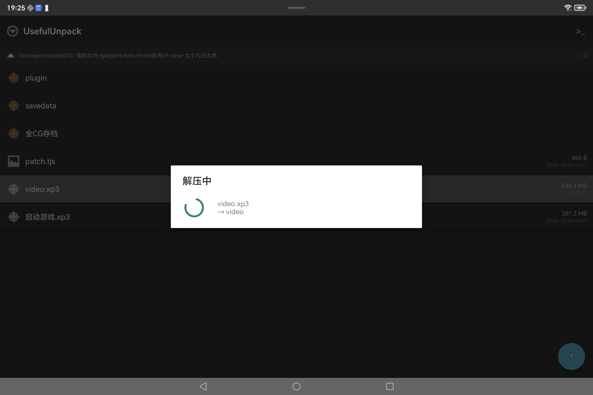
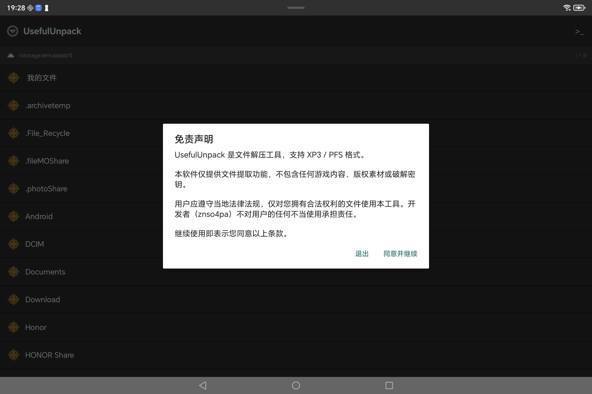
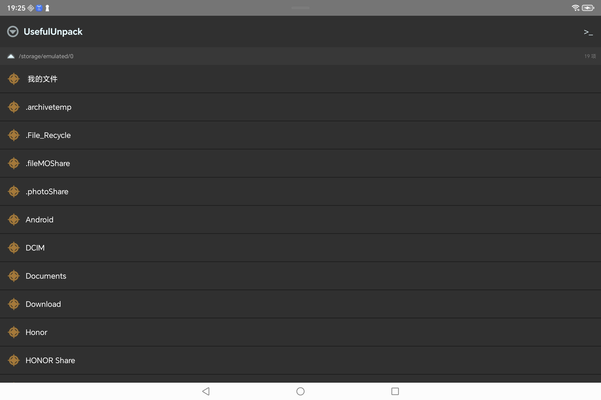
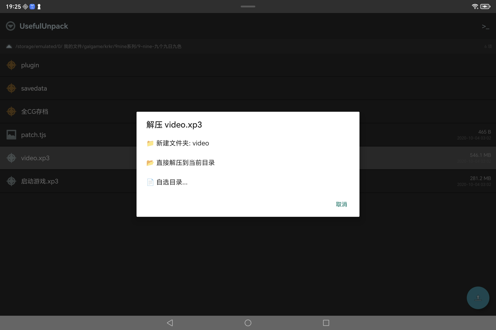

# UsefulUnpack

[**中文**](README-zh.md) | [**English**](README.md)

A lightweight Android file manager and archive extraction tool for visual novel game files.

Supports **XP3** (Kirikiri engine) and **PFS** (Artemis engine) archive formats with native Rust-powered extraction.

---

## Features

| Feature | Description |
|---------|-------------|
| 📁 **XP3 Extraction** | Unpack Kirikiri `.xp3` archives (powered by `xp3` crate) |
| 📦 **PFS Extraction** | Unpack Artemis `.pfs` / `.pf6` / `.pf8` archives (powered by `pf8` crate) |
| 🗂 **File Browser** | ZArchiver-style dual-pane UI with fast scroll and path breadcrumb |
| 📌 **Bookmarks** | Save quick-access paths to frequently used directories |
| ⌨️ **Built-in CLI** | Command-line interface for advanced operations |
| 🌙 **Dark Theme** | Eye-friendly dark theme matching ZArchiver's color scheme |
| 🔒 **Minimal Permissions** | Only requests storage access |

## Screenshots

<p align="middle">
  
  
</p>
<p align="middle">
  
  
</p>

## Installation

Download the latest APK from [Releases](https://github.com/znso4pa/usefulunpack/releases).

Minimum Android 8.0 (API 26). Requires "All files access" permission on Android 11+.

## Building from Source

### Prerequisites

- [Rust](https://rustup.rs) with Android targets:
  ```bash
  rustup target add aarch64-linux-android armv7-linux-androideabi x86_64-linux-android
  ```
- [Android NDK](https://developer.android.com/ndk) (r28+)
- [cargo-ndk](https://github.com/bbqsrc/cargo-ndk): `cargo install cargo-ndk`
- Android SDK with API 34+

### Build

```bash
# 1. Build native .so
ANDROID_NDK_HOME=/path/to/ndk cargo ndk --target aarch64-linux-android --platform 26 build --release

# 2. Copy to jniLibs
cp target/aarch64-linux-android/release/libarchive_core.so app/src/main/jniLibs/arm64-v8a/

# 3. Build APK
ANDROID_HOME=/path/to/sdk ./gradlew assembleRelease

# Output: app/build/outputs/apk/release/app-release.apk
```

Or use the one-step script:
```bash
bash build.sh
```

## Architecture

```
User taps file → Kotlin UI calls ArchiveCore JNI
                         ↓
              libarchive_core.so (Rust)
               ├── xp3 crate → XP3 extraction
               └── pf8 crate → PFS extraction
                         ↓
              Files written to selected directory
```

| Layer | Technology |
|-------|-----------|
| UI | Kotlin + AndroidX + Material Design |
| Bridge | JNI (Java Native Interface) |
| Core | Rust (`xp3` v0.4, `pf8` v0.1) |
| File API | `std::fs::File` + `SyncIo` + `oneshot_async` |

## License

MIT License — see [LICENSE](LICENSE) for details.

Third-party dependencies:
- `xp3` crate — MIT/Apache-2.0
- `pf8` crate — see [crates.io/pf8](https://crates.io/crates/pf8)
- `jni` crate — MIT/Apache-2.0

## Author

**znso4pa (锌帕)**

---

## Disclaimer

This tool is provided for personal use with legally owned files.
The author assumes no responsibility for any misuse.
