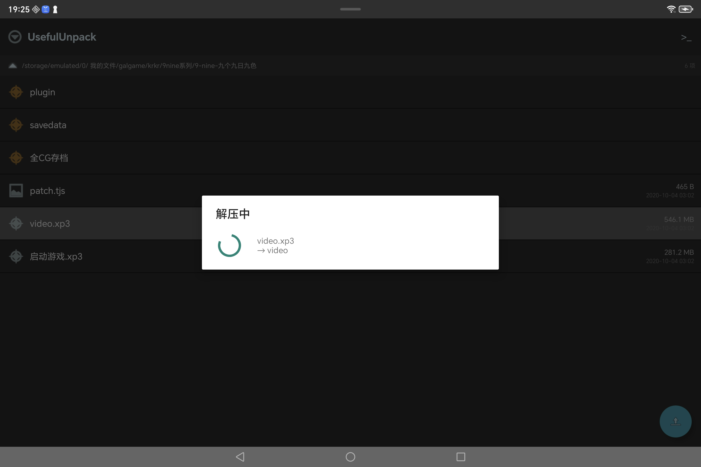
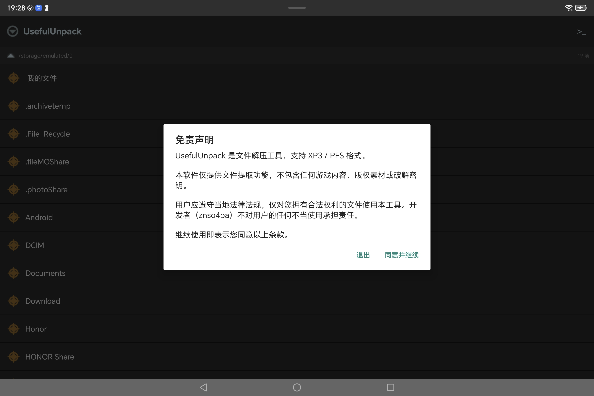
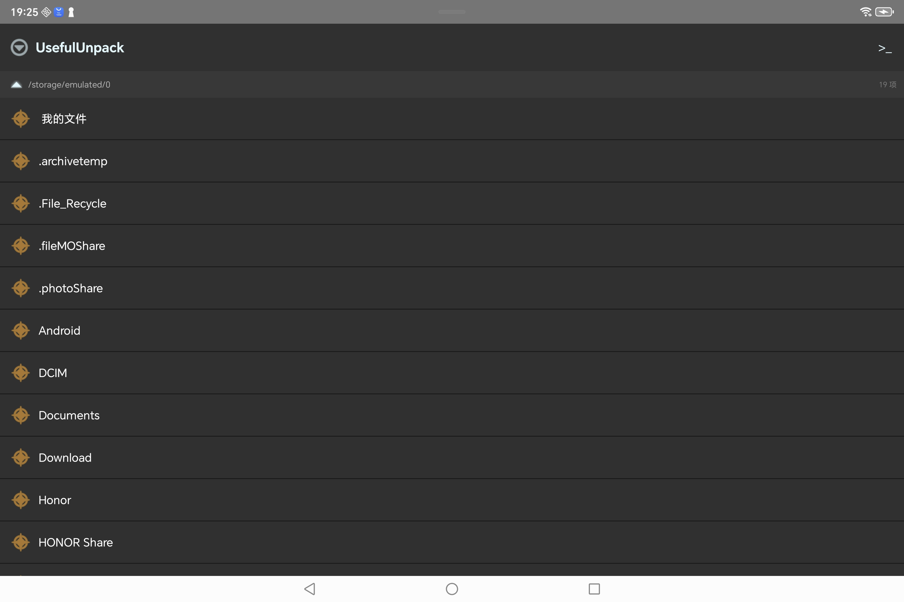
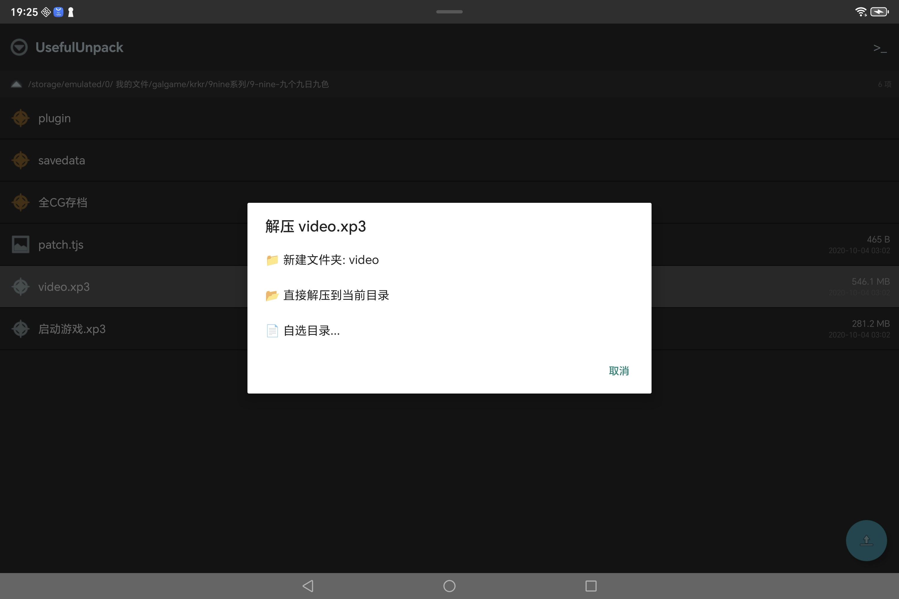

# UsefulUnpack

[**中文**](README-zh.md) | [**English**](README.md) | [**繁體中文**](README-zh-TW.md) | [**日本語**](README-ja.md)

A lightweight Android file manager and archive extraction tool for visual novel game files.

Supports **XP3** (Kirikiri), **PFS** (Artemis), **NSA/SAR** (NScripter), **YPF** (YU-RIS), **ZIP**, **7z**, **RAR**, **LZ4**, and **ISO 9660** disc images — with native Rust-powered extraction.

---

## Features

| Feature | Description |
|---------|-------------|
| 📁 **XP3** | Unpack Kirikiri `.xp3` archives |
| 📦 **PFS** | Unpack Artemis `.pfs` / `.pf6` / `.pf8` archives |
| 📜 **NSA/SAR** | Unpack NScripter `.nsa` / `.sar` archives (LZSS + SPB) |
| 📦 **YPF** | Unpack YU-RIS `.ypf` archives with adaptive boundary detection |
| 💿 **ISO 9660** | Browse and extract ISO disc images (CD/DVD/BD) via isomage |
| 🗜️ **RAR** | Unpack RAR archives (RAR4/5) with password support |
| ⚡ **LZ4** | Decompress LZ4 frame-compressed files |
| 🔍 **Archive Preview** | Browse archive contents as a collapsible tree with checkboxes for selective extraction |
| 📊 **Preview Statistics** | Real-time count/size of total and selected files |
| 🔎 **Global Search** | Filename search + content search (30+ text formats), match highlighting with prev/next navigation, progressive scanning |
| 📦 **In-Archive Search** | One-click unpack text files from preview and open the full global search interface on extracted content |
| 🖼️ **File Preview** | Image (JPG/PNG), audio (MP3/OGG), video (MP4), text/code — jump to matching line on search results |
| 🗜️ **ZIP/7z Compression** | Create ZIP/7z archives, 5 compression levels, AES-256 encryption |
| 🔐 **Extract with Password** | Enter password for encrypted ZIP/7z/RAR archives |
| ✂️ **File Operations** | Long-press to rename, move, delete (irreversible), create folder |
| ☑️ **Batch Multi-Select** | Multi-select mode for batch extract/compress/delete/move |
| 📂 **Batch Preview** | Preview multiple archives at once, select files across all of them |
| 📂 **Local File Preview** | Tap any previewable file in the browser to view directly |
| 🗂 **File Browser** | ZArchiver-style UI with path breadcrumb, fast scroll, folder ⭐ bookmarks |
| 📌 **Bookmarks** | Quick-access paths via star button on folders or slide-out drawer |
| 🏠 **Root Navigation** | One-tap home button to jump to `/storage/emulated/0` |
| 🛡️ **Tap Debounce** | 800ms cooldown prevents accidental duplicate dialogs |
| 🌙 **Dark Theme** | Eye-friendly dark theme matching ZArchiver's color scheme |
| 🦀 **Rust Core** | JNI-powered native `.so` — one per format for isolation |
| 🔒 **Minimal Permissions** | Only requests storage access |

## Screenshots

<p align="middle">
  
  
</p>
<p align="middle">
  
  
</p>

## Installation

Download the latest APK from [Releases](https://github.com/znso4pa/usefulunpack/releases).

Minimum Android 8.0 (API 26). Requires "All files access" permission on Android 11+.

## Building from Source

### Prerequisites

- [Rust](https://rustup.rs) with Android targets:
  ```bash
  rustup target add aarch64-linux-android armv7-linux-androideabi x86_64-linux-android
  ```
- [Android NDK](https://developer.android.com/ndk) (r28+)
- [cargo-ndk](https://github.com/bbqsrc/cargo-ndk): `cargo install cargo-ndk`
- Android SDK with API 34+

### Build

```bash
bash build.sh
```
```
User taps file → Kotlin UI calls format-specific JNI
                         ↓
          libarchive_xp3_core.so  → XP3
          libarchive_pfs_core.so  → PFS
          libarchive_nsa_core.so  → NSA/SAR
          libarchive_iso_core.so  → ISO 9660
          libarchive_ypf_core.so  → YPF (YU-RIS)
          libarchive_zip_core.so  → ZIP
          libarchive_sevenz_core.so → 7z
                         ↓
              Files written to selected directory
```

Each format lives in `crates/<format>-core/` as an independent `cdylib`. Shared utilities (SyncIo, oneshot_async, JSON escaping) live in `crates/common/`.

### YPF (YU-RIS) Format — Three-Layer Defense

YPF uses obfuscated filenames (XOR + Shift-JIS). The parser applies three layers:

1. **GARbro SwapTable** — paired byte lookup for marker→length mapping
2. **Fixed Kaitai mapping table** — fallback for markers not in the swap table
3. **Adaptive boundary detection** — scans for `file_type` (0–6) + `compressed` (0–1) byte pairs to re-align on malformed entries

XOR key auto-detection (0xFF vs 0xC9) is done per-file on the first entry.

## Sources & Credits

### Format Parsers

| Format | Source / Reference | License |
|--------|-------------------|---------|
| **XP3** | [xp3 crate](https://crates.io/crates/xp3) | MIT / Apache-2.0 |
| **PFS / PF6 / PF8** | [pf8 crate](https://crates.io/crates/pf8) | See [crates.io/pf8](https://crates.io/crates/pf8) |
| **NSA / SAR** | [NSA 格式规范](https://orin.page/w/index.php?title=NSA), LZSS/SPB via [GARbro](https://github.com/morkt/GARbro) / [ONScripter](https://github.com/nscripter/nscripter) | Public spec / MIT / GPL |
| **YPF** | [YU-RIS 解包工具](https://github.com/mwzzhang/python-YU-RIS-package-file-unpacker) (Kaitai), [GARbro](https://github.com/morkt/GARbro) SwapTable, XOR + Shift-JIS, zlib | Public spec / MIT |
| **ISO 9660** | [isomage crate](https://crates.io/crates/isomage) | MIT |
| **ZIP** | [zip crate](https://crates.io/crates/zip) | MIT |
| **7z** | [sevenz-rust crate](https://crates.io/crates/sevenz-rust) | MIT / Apache-2.0 |
| **RAR** | [rars crate](https://crates.io/crates/rars) | MIT / Apache-2.0 |
| **LZ4** | [lz4_flex crate](https://crates.io/crates/lz4_flex) | MIT |

### Core Dependencies

| Crate | License | Usage |
|-------|---------|-------|
| `jni` 0.21 | MIT / Apache-2.0 | Android JNI bridge |
| `xp3` 0.4 | MIT / Apache-2.0 | XP3 extraction |
| `pf8` 0.1 | — | PFS/PF6/PF8 extraction |
| `isomage` 0.1 | MIT | ISO 9660 / UDF |
| `flate2` 1 | MIT / Apache-2.0 | zlib (YPF) |
| `encoding_rs` 0.8 | (Apache-2.0 OR MIT) AND BSD-3-Clause | Shift-JIS (YPF) |
| `tokio` 1 | MIT | Async I/O (XP3) |
| `rars` 0.4 | MIT / Apache-2.0 | RAR extraction |
| `lz4_flex` | MIT | LZ4 decompression |

## License

This project: **MIT License** — see [LICENSE](LICENSE).

All third-party dependencies retain their respective licenses as listed above.

## Author

**znso4pa (锌帕)**

GitHub: [github.com/znso4pa/usefulunpack](https://github.com/znso4pa/usefulunpack)

---

## Disclaimer

This tool is intended **solely for managing and accessing files you legally own**.
- It does not contain, provide, or bypass any digital rights management (DRM) or copy protection mechanisms
- All format parsers are based on publicly available format specifications or open-source reference implementations
- The XOR values used in the YPF format parser are part of the public YU-RIS engine format specification, not reverse-engineered secrets
- Do not use this tool for unauthorized extraction or distribution of copyrighted content
- The author assumes no responsibility for any illegal or improper use
